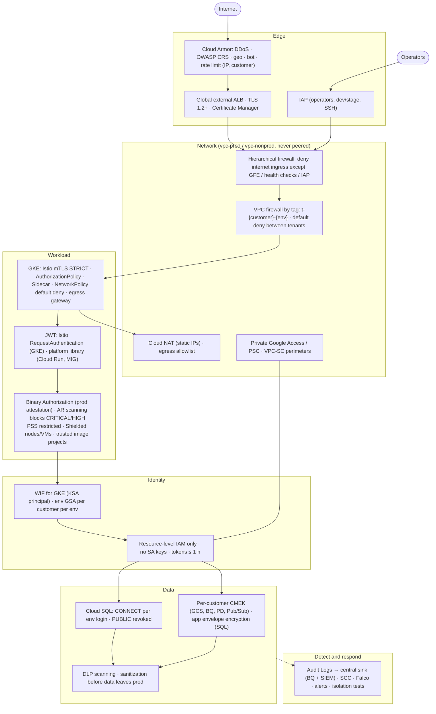

# Network and security

Defense in depth from the edge to the data. See [architecture §10-11](../architecture.md#10-identity-and-encryption).

```mermaid
flowchart TB
  inet(["Internet"])
  op(["Operators"])

  subgraph L1["Edge"]
    armor["Cloud Armor: DDoS · OWASP CRS · geo · bot · rate limit (IP, customer)"]
    lb["Global external ALB · TLS 1.2+ · Certificate Manager"]
    iap["IAP (operators, dev/stage, SSH)"]
  end

  subgraph L2["Network (vpc-prod / vpc-nonprod, never peered)"]
    fwh["Hierarchical firewall: deny internet ingress except GFE / health checks / IAP"]
    fwt["VPC firewall by tag: t-{customer}-{env} · default deny between tenants"]
    nat["Cloud NAT (static IPs) · egress allowlist"]
    pga["Private Google Access / PSC · VPC-SC perimeters"]
  end

  subgraph L3["Workload"]
    mesh["GKE: Istio mTLS STRICT · AuthorizationPolicy · Sidecar · NetworkPolicy default deny · egress gateway"]
    jwt["JWT: Istio RequestAuthentication (GKE) · platform library (Cloud Run, MIG)"]
    binauthz["Binary Authorization (prod attestation) · AR scanning blocks CRITICAL/HIGH<br/>PSS restricted · Shielded nodes/VMs · trusted image projects"]
  end

  subgraph L4["Identity"]
    wif["WIF for GKE (KSA principal) · env GSA per customer per env"]
    iam["Resource-level IAM only · no SA keys · tokens ≤ 1 h"]
  end

  subgraph L5["Data"]
    db["Cloud SQL: CONNECT per env login · PUBLIC revoked"]
    cmek["Per-customer CMEK (GCS, BQ, PD, Pub/Sub) · app envelope encryption (SQL)"]
    dlp["DLP scanning · sanitization before data leaves prod"]
  end

  subgraph L6["Detect and respond"]
    mon["Audit Logs → central sink (BQ + SIEM) · SCC · Falco · alerts · isolation tests"]
  end

  inet --> armor --> lb --> fwh
  op --> iap --> fwh
  fwh --> fwt --> mesh --> jwt --> binauthz
  binauthz --> wif --> iam --> db & cmek
  mesh --> nat
  pga --- iam
  db & cmek --> dlp
  L5 -.-> mon
```
